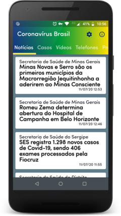
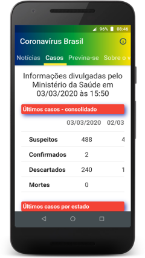
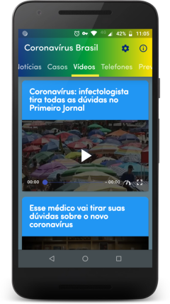
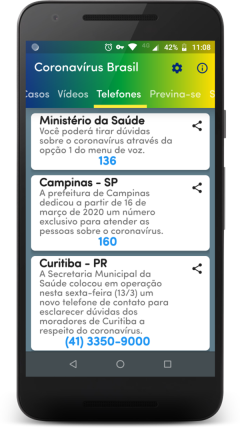
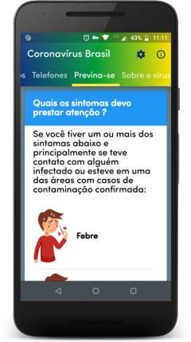
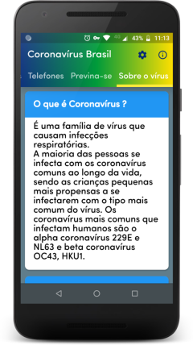
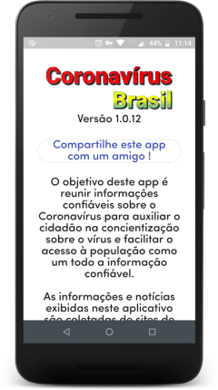

Uma breve introdução
====================

Em dezembro de 2019, já se ouvia sobre a infecção pelo Corona vírus se alastrando na China.
O Brasil ainda não tinha nenhum caso mas via-se que o vírus era muito contagioso.

Nesta mesma época, eu tinha iniciado meus estudos em Flutter, e ao longo dos meses de janeiro
e fevereiro de 2020, pensei em aliar um desafio técnico a possibilidade de criar algo que
pudesse ajudar a socidade a se informar sobre a contaminação que ia se alastrando pelo mundo.

CoronaVirus Brasil é o app que desenvolvi em Flutter como aprendizado nesta tecnologia.

Maiores informações você pode encontrar no meu [perfil](https://www.linkedin.com/pulse/um-app-para-o-coronav%25C3%25ADrus-charles-silva) no Linkedin.

Sobre o App
===========

O app funciona como um agregador de notícias de diferentes sites e também orientações
gerais que o usuário pode ler e se informar sobre o vírus.

Para a parte de notícias, eu usei o Google Firebase Firestore como banco NoSql para armazenar
as notícias fornecidas ao app mobile.
As notícias vinham de feeds RSS de orgãos do governo municipal,estadual e federal, que era processados através de uma Cloud Function, que verificava cada notícia divulgada e se estivesse relacionada ao vírus, era inserida no banco de dados.

O app como está neste repositório é para fins didáticos.
Nele não está as credenciais usadas para uso no Firebase e nem tampouco a lista de sites que alimentam com as notícias.

Este app teve um curto tempo de vida, se quiser saber o que aconteceu consulte [aqui](https://www.linkedin.com/pulse/suspens%C3%A3o-do-aplicativo-coronav%C3%ADrus-brasil-da-google-play-silva/) e [aqui](https://www.linkedin.com/pulse/suspens%25C3%25A3o-do-aplicativo-coronav%25C3%25ADrus-brasil-da-google-play-silva-1f/?trackingId=LxaJh5tZ1o3Fvdbwuuw60g%3D%3D).

Telas do app
============

|&nbsp;|&nbsp;|
|----|----|
|| Notícias vindo fontes confiáveis, como orgãos do governo municipal, estadual e federal|
|| Em março/2020 o governo disponibilizava em um site, estatísticas sobre o número de novos casos separados por estados. O app fazia o parsing destes dados para permitir ao usuário acompanhar dia-a-dia a evolução da contaminação. Esta plataforma do governo durou mais poucos meses e foi substituída por um novo sistema.
|| Vídeos com médicos e infectologistas fornecendo informações sobre o Corona vírus e esclarecendo dúvidas da população..
|| Telefones úteis divulgados pelas prefeituras de alguns municípios que tinham canal dedicado para esclarecer dúvidas da população.
|| Orientações sobre formas de prevenção contra a contaminação pelo Corona vírus.
|| Informações sobre o que é o vírus, sua origem e presença no país.
|| Informações sobre o app.